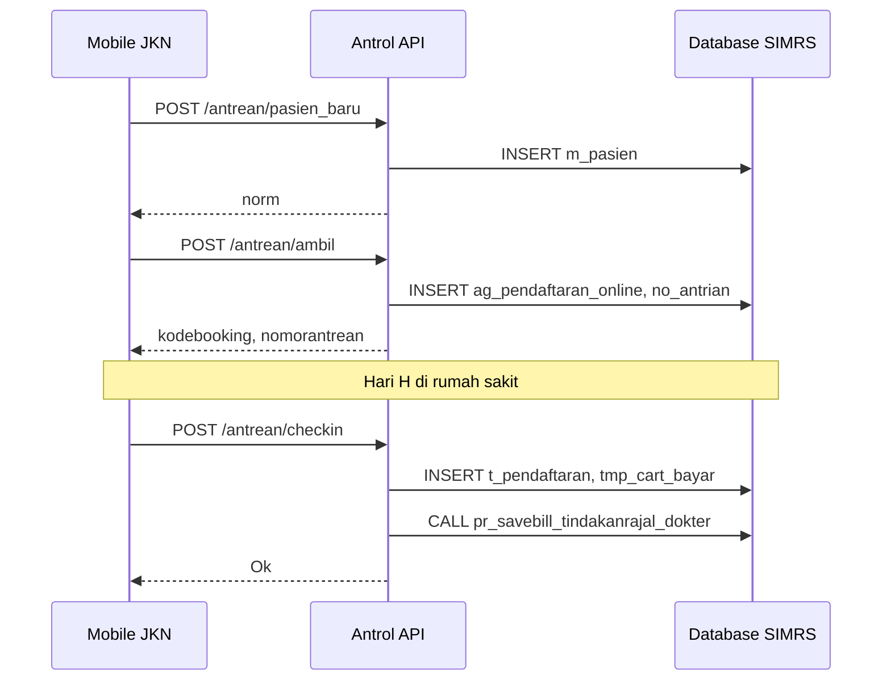

# Antrol MJKN — Dokumentasi Lengkap

Bridge API antara **Mobile JKN (MJKN)** / **BPJS Kesehatan** dengan **SIMRS** rumah sakit. Aplikasi ini mengimplementasikan spesifikasi webservice Antrean Online RS sesuai standar BPJS, sehingga pasien dapat mengambil antrean, check-in, dan membatalkan antrean melalui aplikasi Mobile JKN.

---

## Daftar Isi

1. [Ringkasan Proyek](#ringkasan-proyek)
2. [Arsitektur](#arsitektur)
3. [Tech Stack](#tech-stack)
4. [Struktur Proyek](#struktur-proyek)
5. [Konfigurasi & Instalasi](#konfigurasi--instalasi)
6. [Autentikasi](#autentikasi)
7. [Format Response](#format-response)
8. [Daftar Endpoint](#daftar-endpoint)
9. [Detail Endpoint](#detail-endpoint)
10. [Alur Bisnis Utama](#alur-bisnis-utama)
11. [Database & Model](#database--model)
12. [Integrasi Eksternal](#integrasi-eksternal)
13. [Catatan Implementasi](#catatan-implementasi)

---

## Ringkasan Proyek

| Aspek | Keterangan |
|-------|------------|
| **Nama** | Antrol MJKN (antrol-new) |
| **Framework** | Laravel 13 |
| **PHP** | ^8.3 |
| **Fungsi utama** | Webservice antrean online RS untuk integrasi Mobile JKN |
| **Base URL API** | `{APP_URL}/api` |
| **Health check** | `GET /up` |
| **Root web** | `GET /` → menampilkan `"Webservice RS BPJS - {env} - {version}"` |

Aplikasi **tidak** memiliki frontend pasien. Semua interaksi dilakukan oleh sistem BPJS (Mobile JKN) yang memanggil endpoint REST API ini. Data antrean, pasien, poli, dan dokter disimpan/dibaca dari database **SIMRS** yang sudah ada.

---

## Arsitektur

```
┌─────────────────┐         ┌──────────────────────┐         ┌─────────────────┐
│  Mobile JKN     │  HTTPS  │   Antrol MJKN        │   SQL   │   SIMRS (mysql2)│
│  (BPJS)         │────────▶│   Laravel API        │────────▶│   no_antrian    │
└─────────────────┘         │                      │         │   ag_pendaftaran│
                            │   ┌──────────────┐   │         │   m_pasien      │
                            │   │ mysql (auth) │   │         │   m_poly        │
                            │   │ users, JWT   │   │         │   t_jadwal_dokter│
                            │   └──────────────┘   │         └─────────────────┘
                            └──────────┬───────────┘
                                       │ HTTP (opsional)
                                       ▼
                            ┌──────────────────────┐
                            │ Sync BPJS / Rujukan  │
                            │ (internal service)   │
                            └──────────────────────┘
```

### Dua Koneksi Database

| Koneksi | Env prefix | Fungsi |
|---------|------------|--------|
| `mysql` (default) | `DB_*` | Autentikasi API (`users`, session, queue, cache) |
| `mysql2` | `DB_*_SIMRS` | Data operasional rumah sakit (antrean, pasien, poli, dll.) |

Hampir semua model bisnis (`Antrean`, `Pasien`, `Poli`, `Dokter`, dll.) menggunakan koneksi `mysql2`.

---

## Tech Stack

| Komponen | Paket / Teknologi |
|----------|-------------------|
| Framework | Laravel ^13.8 |
| Autentikasi | `php-open-source-saver/jwt-auth` (JWT) |
| Integrasi BPJS | `najmulfaiz/bpjs` (VClaim, Antrean WS) |
| HTTP Client | Laravel Http / Guzzle |
| Queue | Database driver |
| Timezone | `Asia/Jakarta` |

---

## Struktur Proyek

```
antrol-new/
├── app/
│   ├── Http/
│   │   ├── Controllers/
│   │   │   ├── AntreanController.php    # Antrean online (utama)
│   │   │   ├── AuthController.php       # Login JWT
│   │   │   └── JadwalOperasiController.php
│   │   ├── Middleware/
│   │   │   └── JwtMiddleware.php        # Validasi x-token + x-username
│   │   └── Resources/
│   │       ├── JadwalOperasiRSResource.php
│   │       └── JadwalOperasiPasienResource.php
│   ├── Helpers/
│   │   ├── Bpjs.php                     # Helper rujukan & HFIS
│   │   └── ResponseFormatter.php        # Format response standar BPJS
│   ├── Jobs/
│   │   └── SyncRujukanJob.php           # Sync rujukan ke service internal
│   └── Models/                          # Eloquent → tabel SIMRS
├── config/
│   ├── auth.php                         # Guard api = jwt
│   ├── bpjs.php                         # Kredensial BPJS
│   ├── database.php                     # mysql + mysql2
│   └── jwt.php
├── routes/
│   └── api.php                          # Semua endpoint API
└── docs/
    └── README.md                        # Dokumen ini
```

---

## Konfigurasi & Instalasi

### Prasyarat

- PHP 8.3+
- Composer
- MySQL (2 database: auth + SIMRS)
- Extension: pdo_mysql, openssl, mbstring

### Langkah Instalasi

```bash
composer install
cp .env.example .env
php artisan key:generate
php artisan jwt:secret
php artisan migrate
```

### Variabel Environment Penting

```env
APP_URL=http://localhost
APP_TIMEZONE=Asia/Jakarta

# Database auth (Laravel)
DB_CONNECTION=mysql
DB_HOST=127.0.0.1
DB_DATABASE=antrol_new
DB_USERNAME=root
DB_PASSWORD=

# Database SIMRS
DB_HOST_SIMRS=127.0.0.1
DB_DATABASE_SIMRS=simrs
DB_USERNAME_SIMRS=root
DB_PASSWORD_SIMRS=

# JWT
JWT_SECRET=
JWT_TTL=3600

# BPJS
BPJS_BASE_URL=https://apijkn.bpjs-kesehatan.go.id
BPJS_CONS_ID=
BPJS_SECRET_KEY=
BPJS_VCLAIM_USER_KEY=
BPJS_ANTREAN_USER_KEY=
BPJS_VCLAIM_SERVICE_NAME=vclaim-rest
BPJS_ANTREAN_SERVICE_NAME=antreanrs
```

### Menjalankan Aplikasi

```bash
php artisan serve
# atau
composer dev   # serve + queue + vite
```

Buat user API di tabel `users` (username + password bcrypt) agar BPJS dapat login.

---

## Autentikasi

Mengikuti pola autentikasi webservice BPJS Antrean RS.

### 1. Login — dapatkan token

```
GET /api/login
```

**Header:**

| Header | Wajib | Keterangan |
|--------|-------|------------|
| `x-username` | Ya | Username user API |
| `x-password` | Ya | Password user API |

**Response sukses:** token JWT dengan prefix `Bearer `.

### 2. Request endpoint terproteksi

Semua endpoint selain `login` memerlukan middleware `jwt`.

**Header wajib:**

| Header | Keterangan |
|--------|------------|
| `x-username` | Harus sama dengan user pemilik token |
| `x-token` | Token JWT (tanpa prefix `Bearer`) |
| `Content-Type` | `application/json` |

**Validasi middleware (`JwtMiddleware`):**

- Token dibaca dari header `x-token` (bukan `Authorization`)
- Username di header harus cocok dengan user hasil decode JWT
- Token expired / invalid / blacklisted → error 201

---

## Format Response

Semua response menggunakan helper `ResponseFormatter` dengan struktur standar BPJS:

```json
{
  "metadata": {
    "code": 200,
    "message": "Ok"
  },
  "response": { }
}
```

| HTTP Status | Penggunaan |
|-------------|------------|
| `200` | Sukses |
| `201` | Error bisnis / validasi (standar BPJS Antrol) |
| `202` | Kondisi khusus (mis. pasien belum terdaftar) |
| `400` | Error default formatter (jarang dipakai di controller) |

> **Catatan:** BPJS Antrol menggunakan HTTP status **201** untuk banyak kondisi error, bukan 4xx konvensional.

---

## Daftar Endpoint

| # | Method | Path | Auth | Controller | Fungsi |
|---|--------|------|------|------------|--------|
| 1 | `GET` | `/api/login` | Tidak | `AuthController@login` | Autentikasi, dapat JWT |
| 2 | `POST` | `/api/antrean/status` | JWT | `AntreanController@status` | Cek status antrean poli/dokter |
| 3 | `POST` | `/api/antrean/pasien_baru` | JWT | `AntreanController@pasien_baru` | Registrasi pasien baru |
| 4 | `POST` | `/api/antrean/ambil` | JWT | `AntreanController@ambilv3` | Ambil nomor antrean |
| 5 | `POST` | `/api/antrean/sisa` | JWT | `AntreanController@sisa` | Sisa antrean by kode booking |
| 6 | `POST` | `/api/antrean/batal` | JWT | `AntreanController@batal` | Batalkan antrean |
| 7 | `POST` | `/api/antrean/checkin` | JWT | `AntreanController@checkin` | Check-in pasien di RS |
| 8 | `POST` | `/api/jadwal_operasi/rs` | JWT | `JadwalOperasiController@all` | Jadwal operasi RS per rentang tanggal |
| 9 | `POST` | `/api/jadwal_operasi/pasien` | JWT | `JadwalOperasiController@pasien` | Jadwal operasi per no peserta |

---

## Detail Endpoint

---

### 1. Login

**`GET /api/login`**

Mendapatkan token JWT untuk akses endpoint lainnya.

#### Request Header

```
x-username: {username}
x-password: {password}
```

#### Response Sukses (200)

```json
{
  "metadata": {
    "code": 200,
    "message": "Ok"
  },
  "response": {
    "token": "Bearer eyJ0eXAiOiJKV1QiLCJhbGc..."
  }
}
```

#### Response Error (201)

| Pesan | Kondisi |
|-------|---------|
| `Username dan password harus diisi.` | Header kosong |
| `Username atau Password Tidak Sesuai` | Kredensial salah |

---

### 2. Status Antrean

**`POST /api/antrean/status`**

Menampilkan informasi antrean aktif untuk kombinasi poli, dokter, tanggal, dan jam praktek. Digunakan Mobile JKN sebelum pasien mengambil antrean.

#### Request Body

| Field | Tipe | Wajib | Validasi | Keterangan |
|-------|------|-------|----------|------------|
| `kodepoli` | string | Ya | — | Kode poli BPJS (`KODE_BPJS` di `m_poly`) |
| `kodedokter` | string | Ya | — | Kode DPJP BPJS (`KODE_DPJP_BPJS` di `m_dokter`) |
| `tanggalperiksa` | date | Ya | format `Y-m-d` | Tanggal rencana periksa |
| `jampraktek` | string | Ya | — | Format `{jam_mulai}-{jam_selesai}`, contoh `08:00-12:00` |

#### Logika Bisnis

1. Validasi poli dan dokter ada di master SIMRS
2. Tanggal tidak boleh lampau (`< hari ini`)
3. Tanggal maksimal **+5 hari** dari hari ini
4. Cek jadwal dokter di tabel `jadwal_dokter` (`JamPelayanan`) sesuai hari, jam, poli, dokter
5. Hitung total antrean (tidak batal) per sesi
6. Hitung antrean yang sedang menunggu (`pendaftaran.status = 0`)

#### Response Sukses (200)

```json
{
  "metadata": { "code": 200, "message": "Ok" },
  "response": {
    "namapoli": "Poli Saraf",
    "namadokter": "dr. Contoh, Sp.S",
    "totalantrean": 15,
    "sisaantrean": 3,
    "antreanpanggil": 12,
    "sisakuotajkn": 45,
    "kuotajkn": 60,
    "sisakuotanonjkn": 45,
    "kuotanonjkn": 60,
    "keterangan": ""
  }
}
```

| Field response | Keterangan |
|----------------|------------|
| `totalantrean` | Jumlah antrean terdaftar (tidak batal) |
| `sisaantrean` | Jumlah pasien belum dilayani (status 0) |
| `antreanpanggil` | Nomor urut antrean pertama yang menunggu |
| `sisakuotajkn` / `sisakuotanonjkn` | Sisa kuota (default kuota 60 jika kosong) |

#### Response Error (201)

| Pesan | Kondisi |
|-------|---------|
| `Poli tidak belum tersedia untuk pendaftaran online.` | Poli tidak ditemukan |
| `Dokter belum tersedia untuk pendaftaran online` | Dokter tidak ditemukan |
| `Tanggal Periksa Tidak Berlaku` | Tanggal sudah lewat |
| `Tanggal Periksa Belum Tersedia` | Tanggal > +5 hari |
| `Jadwal Dokter ... Belum Tersedia untuk online...` | Jadwal tidak ada di `jadwal_dokter` |

---

### 3. Registrasi Pasien Baru

**`POST /api/antrean/pasien_baru`**

Mendaftarkan pasien baru ke SIMRS jika NIK/no kartu belum ada. Setelah sukses, pasien dapat mengambil antrean via `/antrean/ambil`.

#### Request Body

| Field | Tipe | Wajib | Validasi |
|-------|------|-------|----------|
| `nomorkartu` | string | Ya | 13 digit |
| `nik` | string | Ya | 16 digit |
| `nomorkk` | string | Ya | 16 digit |
| `nama` | string | Ya | max 255 |
| `jeniskelamin` | string | Ya | `L` atau `P` |
| `tanggallahir` | date | Ya | ≤ hari ini |
| `nohp` | string | Ya | max 20 |
| `alamat` | string | Ya | — |
| `kodeprop` | string | Ya | — |
| `namaprop` | string | Ya | — |
| `kodedati2` | string | Ya | — |
| `namadati2` | string | Ya | — |
| `kodekec` | string | Ya | — |
| `namakec` | string | Ya | — |
| `kodekel` | string | Ya | — |
| `namakel` | string | Ya | — |
| `rw` | string | Ya | — |
| `rt` | string | Ya | — |

#### Logika Bisnis

1. Cek duplikasi berdasarkan NIK atau nomor kartu BPJS
2. Generate NOMR baru: `MAX(nomr) + 1` (format 6 digit)
3. Simpan ke tabel `m_pasien`

#### Response Sukses (200)

```json
{
  "metadata": {
    "code": 200,
    "message": "Harap datang ke admisi untuk melengkapi data rekam medis"
  },
  "response": {
    "norm": "012345"
  }
}
```

#### Response Error (201)

| Pesan | Kondisi |
|-------|---------|
| `Data Peserta Sudah Pernah Dientrikan` | Pasien sudah ada |
| `Pendaftaran pasien baru gagal` | Gagal simpan ke DB |

---

### 4. Ambil Antrean

**`POST /api/antrean/ambil`**

Endpoint utama pengambilan nomor antrean. Route memetakan ke method **`ambilv3`** (versi terbaru).

#### Request Body

| Field | Tipe | Wajib | Validasi | Keterangan |
|-------|------|-------|----------|------------|
| `nomorkartu` | string | Ya | 13 digit | No kartu BPJS |
| `nik` | string | Ya | 16 digit | NIK |
| `nohp` | string | Ya | 10–13 digit | No HP |
| `kodepoli` | string | Ya | exists `m_poly.KODE_BPJS` | Kode poli BPJS |
| `norm` | string | Tidak | 6 digit | No rekam medis |
| `tanggalperiksa` | date | Ya | — | Tanggal periksa |
| `kodedokter` | string | Ya | exists `m_dokter.KODE_DPJP_BPJS` | Kode dokter BPJS |
| `jampraktek` | string | Ya | — | `{mulai}-{selesai}` |
| `jeniskunjungan` | int | Ya | `1`, `2`, `3`, atau `4` | Jenis kunjungan BPJS |
| `nomorreferensi` | string | Ya | — | No rujukan / surat kontrol |

**Jenis kunjungan (`jeniskunjungan`):**

| Kode | Arti (standar BPJS) |
|------|---------------------|
| 1 | Rujukan FKTP |
| 2 | Rujukan Internal |
| 3 | Kontrol |
| 4 | Rujukan Antar RS |

#### Logika Bisnis (ambilv3)

1. **Batas waktu hari-H:** jika `tanggalperiksa` = hari ini, pendaftaran ditutup **30 menit sebelum jam selesai praktek**
2. **Rentang tanggal:** maksimal +30 hari ke depan
3. **Mapping poli khusus:** `kodepoli = IRM` → poli kode internal `34`
4. **Jadwal dokter:** harus ada di `t_jadwal_dokter` untuk tanggal tersebut
5. **Jam pelayanan:** harus cocok di `jadwal_dokter` (poli + dokter + hari + jam mulai/selesai)
6. **Kuota per sesi:** dihitung per dokter + sesi (`pagi`/`siang`/dll.)
7. **Duplikasi:** 1 antrean per pasien (NOMR/NIK/no kartu) per tanggal per poli
8. **Pasien harus ada** di `m_pasien`; jika tidak → error 202
9. Simpan `ag_pendaftaran_online` + `ag_pendaftaran_online_bpjs`
10. Simpan `no_antrian` dengan sesi dan estimasi waktu layanan
11. Trigger sync BPJS via HTTP GET ke service internal

#### Format Kode Booking (v3)

```
{YYMMDD}{kode_poli_3digit}{kode_dokter_3digit}-{no_urut_3digit}
```

Contoh: `250617034803-001`

#### Perhitungan Estimasi

- Estimasi = `jam_mulai + (estimasi_layanan × (no_urut - 1))` menit
- Dibatasi maksimal **30 menit sebelum jam selesai praktek**
- Default estimasi per pasien: **6 menit** jika tidak diset

#### Response Sukses (200)

```json
{
  "metadata": { "code": 200, "message": "Ok" },
  "response": {
    "nomorantrean": 1,
    "angkaantrean": 1,
    "kodebooking": "250617034803-001",
    "norm": "012345",
    "namapoli": "Poli Saraf",
    "namadokter": "dr. Contoh, Sp.S",
    "estimasidilayani": 1718595600000,
    "sisakuotajkn": 59,
    "kuotajkn": 60,
    "sisakuotanonjkn": 59,
    "kuotanonjkn": 60,
    "keterangan": "Peserta harap 60 menit lebih awal guna pencatatan administrasi."
  }
}
```

| Field | Keterangan |
|-------|------------|
| `estimasidilayani` | Unix timestamp **milidetik** |
| `sisakuotajkn` | Sisa kuota setelah booking ini |

#### Response Error

| Code | Pesan | Kondisi |
|------|-------|---------|
| 201 | `Pendaftaran untuk hari ini sudah ditutup` | Lewat batas waktu hari-H |
| 201 | `Pendaftaran ke Poli Ini Belum Tersedia` | Tanggal > +30 hari |
| 201 | `Jadwal Dokter ... Belum Tersedia...` | Jadwal/t_jadwal_dokter tidak ada |
| 201 | `Kuota untuk poli ini sudah penuh` | Kuota habis |
| 201 | `Nomor Antrean Hanya Dapat Diambil 1 Kali...` | Duplikasi |
| **202** | `Data pasien ini tidak ditemukan...` | Pasien belum terdaftar → panggil `/pasien_baru` |

#### Versi Method (tidak aktif di route)

| Method | Perbedaan utama |
|--------|-----------------|
| `ambil` (v1) | Kuota per poli, kode booking `{YYYYMMDD}-{poli}-{urut}`, dispatch `SyncRujukanJob` |
| `ambilv2` | Kuota poli/JAN berbeda, tanpa sesi dokter |
| **`ambilv3`** | **Aktif** — kuota per dokter+sesi, kode booking baru, sync HTTP langsung |

---

### 5. Sisa Antrean

**`POST /api/antrean/sisa`**

Mengambil status antrean berdasarkan kode booking. Mirip `/antrean/status` tetapi lookup via booking.

#### Request Body

| Field | Tipe | Wajib |
|-------|------|-------|
| `kodebooking` | string | Ya |

`kodebooking` dapat berupa `kode_booking` di `no_antrian` atau `id_online` (ID pendaftaran online).

#### Response Sukses (200)

Struktur sama dengan `/antrean/status`:

```json
{
  "metadata": { "code": 200, "message": "Ok" },
  "response": {
    "namapoli": "...",
    "namadokter": "...",
    "totalantrean": 0,
    "sisaantrean": 0,
    "antreanpanggil": null,
    "sisakuotajkn": 0,
    "kuotajkn": 60,
    "sisakuotanonjkn": 0,
    "kuotanonjkn": 60,
    "keterangan": ""
  }
}
```

#### Response Error (201)

| Pesan | Kondisi |
|-------|---------|
| `Kode booking tidak ditemukan (Antrean)` | Tidak ada di `no_antrian` |
| `Kode booking tidak ditemukan (Pendaftaran)` | Tidak ada pendaftaran online terkait |
| `Jadwal Dokter ... Belum Tersedia...` | Jadwal tidak ditemukan |

---

### 6. Batal Antrean

**`POST /api/antrean/batal`**

Membatalkan antrean yang belum dilayani.

#### Request Body

| Field | Tipe | Wajib |
|-------|------|-------|
| `kodebooking` | string | Ya |
| `keterangan` | string | Ya | Alasan pembatalan |

#### Logika Bisnis

1. Cari antrean via `kode_booking` atau `id_online`
2. Tolak jika `status_hadir = 1` (sudah check-in/dilayani)
3. Tolak jika sudah `batal = 1`
4. Update `ag_pendaftaran_online.batal = 1` + `alasan_batal`
5. Update `no_antrian.batal = 1` + `alasan_batal`

#### Response Sukses (200)

```json
{
  "metadata": { "code": 200, "message": "Ok" },
  "response": []
}
```

#### Response Error (201)

| Pesan | Kondisi |
|-------|---------|
| `Kode booking tidak ditemukan (Antrean)` | Antrean tidak ada |
| `Kode booking tidak ditemukan (Pendaftaran)` | Pendaftaran tidak ada |
| `Pasien Sudah Dilayani, Antrean Tidak Dapat Dibatalkan` | Sudah check-in |
| `Antrean Tidak Ditemukan atau Sudah Dibatalkan` | Sudah batal |
| `Gagal` | Error simpan |

---

### 7. Check-in Antrean

**`POST /api/antrean/checkin`**

Check-in pasien saat tiba di rumah sakit. Membuat record pendaftaran rawat jalan di SIMRS dan menagih tarif pendaftaran.

#### Request Body

| Field | Tipe | Wajib | Keterangan |
|-------|------|-------|------------|
| `kodebooking` | string | Ya | Kode booking atau id_online |
| `waktu` | int | Ya | Timestamp **milidetik** saat check-in |

#### Logika Bisnis

1. Validasi antrean dan pendaftaran online ada
2. Tanggal check-in (`waktu/1000`) harus sama dengan `tanggal_periksa`
3. Tolak jika sudah check-in (`status_hadir = 1`)
4. Tolak jika antrean sudah dibatalkan
5. **Buat record `t_pendaftaran`** (model `Pendaftaran`) dengan status aktif
6. **Buat `tmp_cart_bayar`** berdasarkan tarif poli + profesi dokter
7. **Panggil stored procedure** `pr_savebill_tindakanrajal_dokter(...)` di SIMRS
8. Update `status_hadir = 1`, `status_berkas = 1` di pendaftaran online
9. Link `no_antrian.idxdaftar` ke pendaftaran baru

#### Response Sukses (200)

```json
{
  "metadata": { "code": 200, "message": "Ok" },
  "response": []
}
```

#### Response Error (201)

| Pesan | Kondisi |
|-------|---------|
| `Kode booking tidak ditemukan` | Antrean tidak ada |
| `Check in hanya dapat dilakukan sesuai tanggal periksa` | Tanggal tidak cocok |
| `Pasien sudah melakukan check in` | Duplikasi check-in |
| `Antrean tidak ditemukan atau sudah dibatalkan` | Antrean batal |

---

### 8. Jadwal Operasi RS

**`POST /api/jadwal_operasi/rs`**

Mengembalikan daftar jadwal operasi rumah sakit dalam rentang tanggal (untuk sinkronisasi BPJS/Aplicares).

#### Request Body

| Field | Tipe | Wajib |
|-------|------|-------|
| `tanggalawal` | date | Ya |
| `tanggalakhir` | date | Ya |

#### Logika Bisnis

- Query `t_operasi` where tanggal between awal–akhir
- Filter status `selesai` atau `NULL`
- Transform via `JadwalOperasiRSResource`

#### Response Sukses (200)

```json
{
  "metadata": { "code": 200, "message": "Ok" },
  "response": {
    "list": [
      {
        "kodebooking": "12345",
        "tanggaloperasi": "2025-06-17",
        "jenistindakan": "Appendectomy",
        "kodepoli": "SAR",
        "namapoli": "Poli Bedah",
        "terlaksana": 1,
        "nopeserta": "0001234567890",
        "lastupdate": 1718595600000
      }
    ]
  }
}
```

#### Response Error (201)

| Pesan | Kondisi |
|-------|---------|
| `Tanggal akhir tidak boleh melebihi tanggal awal` | Validasi tanggal |

---

### 9. Jadwal Operasi Pasien

**`POST /api/jadwal_operasi/pasien`**

Jadwal operasi berdasarkan nomor peserta BPJS pasien.

#### Request Body

| Field | Tipe | Wajib |
|-------|------|-------|
| `nopeserta` | string | Ya | 13 digit |

#### Response Sukses (200)

```json
{
  "metadata": { "code": 200, "message": "Ok" },
  "response": {
    "list": [
      {
        "kodebooking": "12345",
        "tanggaloperasi": "2025-06-17",
        "jenistindakan": "Appendectomy",
        "kodepoli": "SAR",
        "namapoli": "Poli Bedah",
        "terlaksana": 0
      }
    ]
  }
}
```

---

## Alur Bisnis Utama

### Alur Pasien Baru → Ambil Antrean → Check-in



### Alur Pembatalan

```
Mobile JKN → POST /antrean/batal
           → Update ag_pendaftaran_online (batal=1)
           → Update no_antrian (batal=1)
```

---

## Database & Model

### Tabel SIMRS Utama (koneksi `mysql2`)

| Model | Tabel | Fungsi |
|-------|-------|--------|
| `Antrean` | `no_antrian` | Nomor antrean & kode booking |
| `AgPendaftaranOnline` | `ag_pendaftaran_online` | Pendaftaran online MJKN |
| `AgPendaftaranOnlineBpjs` | `ag_pendaftaran_online_bpjs` | Data BPJS pendaftaran |
| `Pasien` | `m_pasien` | Master pasien |
| `Poli` | `m_poly` | Master poli |
| `Dokter` | `m_dokter` | Master dokter |
| `JadwalDokter` | `t_jadwal_dokter` | Jadwal dokter per tanggal |
| `JamPelayanan` | `jadwal_dokter` | Jam praktek & kuota per sesi |
| `KuotaPoli` | — | Kuota poli per hari |
| `PoliEstimasi` | — | Estimasi waktu layanan poli |
| `Pendaftaran` | `t_pendaftaran` | Pendaftaran rawat jalan (check-in) |
| `Tarif` | — | Tarif tindakan pendaftaran |
| `TmpCartBayar` | — | Keranjang billing sementara |
| `Operasi` | `t_operasi` | Jadwal operasi |

### Tabel Auth (koneksi `mysql`)

| Tabel | Fungsi |
|-------|--------|
| `users` | Kredensial API BPJS (username/password) |
| `sessions` | Session Laravel |
| `jobs` | Queue jobs |

---

## Integrasi Eksternal

### BPJS Web Service

Helper `App\Helpers\Bpjs` menyediakan:

- `rujukan_by_nomorreferensi()` — validasi rujukan via VClaim (saat ini **dikomentari** di controller)
- `cek_jadwal_hfis()` — cek jadwal HFIS via Antrean WS (saat ini **dikomentari**)

Konfigurasi di `config/bpjs.php`, kredensial dari `.env`.

### Sync Internal

Setelah ambil antrean (`ambilv3`), sistem memanggil:

```
GET http://10.0.108.247:8000/api/sync-bpjs?id={id_pendaftaran_online}
```

Job `SyncRujukanJob` (v1) memanggil:

```
GET http://10.0.108.249:82/bpjs?id={id_online}
```

> URL hardcoded — sesuaikan dengan environment production.

### PPK Pelayanan

Kode PPK RS diset di `ag_pendaftaran_online_bpjs.ppk_pelayanan = 1133R001`.

---

## Catatan Implementasi

1. **Route aktif vs method legacy:** Hanya `ambilv3` yang dipakai di route. Method `ambil` dan `ambilv2` masih ada di controller sebagai referensi versi lama.

2. **Validasi rujukan dinonaktifkan:** Pengecekan rujukan BPJS dan HFIS saat ini di-comment; pendaftaran tidak memvalidasi `nomorreferensi` ke VClaim.

3. **Cara bayar default:** Semua pendaftaran online diset `cara_bayar = 10` (BPJS/JKN).

4. **Sumber pendaftaran:** Field `via = mobile_jkn`, `via_new_app = 1`, `versi_baru = 1`.

5. **Logging:** Endpoint `ambilv3` dan `checkin` menulis log ke `storage/logs/laravel.log`.

6. **Stored procedure check-in:** Check-in bergantung pada SP `pr_savebill_tindakanrajal_dokter` yang harus ada di database SIMRS.

7. **Middleware JWT:** Token harus dikirim via header `x-token`, bukan `Authorization: Bearer`.

8. **Error code BPJS:** Sebagian besar error mengembalikan HTTP 201 (bukan 400/422), sesuai konvensi webservice Antrol BPJS.

---

## Contoh Penggunaan (cURL)

### Login

```bash
curl -X GET "http://localhost/api/login" \
  -H "x-username: bpjs_user" \
  -H "x-password: secret"
```

### Ambil Antrean

```bash
curl -X POST "http://localhost/api/antrean/ambil" \
  -H "Content-Type: application/json" \
  -H "x-username: bpjs_user" \
  -H "x-token: {JWT_TOKEN}" \
  -d '{
    "nomorkartu": "0001234567890",
    "nik": "3201010101010001",
    "nohp": "081234567890",
    "kodepoli": "SAR",
    "tanggalperiksa": "2025-06-20",
    "kodedokter": "12345",
    "jampraktek": "08:00-12:00",
    "jeniskunjungan": "1",
    "nomorreferensi": "R12345678901234"
  }'
```

### Check-in

```bash
curl -X POST "http://localhost/api/antrean/checkin" \
  -H "Content-Type: application/json" \
  -H "x-username: bpjs_user" \
  -H "x-token: {JWT_TOKEN}" \
  -d '{
    "kodebooking": "250620034803-001",
    "waktu": 1718863200000
  }'
```

---

## Lisensi

Proyek ini dibangun di atas Laravel Framework (MIT License).
